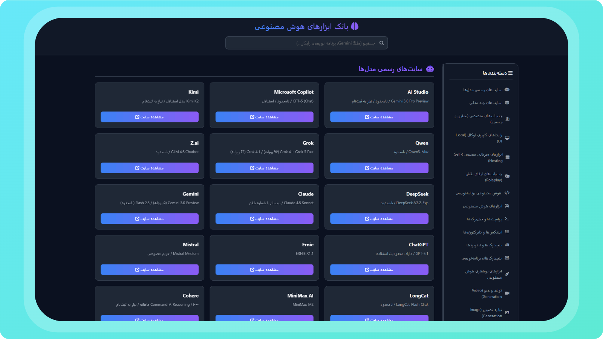

<div align="center">

# 🧠 AI Links Directory | بانک جامع ابزارهای هوش مصنوعی

[](https://xpoury4.github.io/Ai-Links)
[](https://x.com/TheRealPourya)
[](https://xpoury4.github.io/Ai-Links)
[](LICENSE)

<br>

**یک دایرکتوری کامل، برای دسترسی به  ابزارهای هوش مصنوعی.**  
*شامل چت‌بات‌ها، تولید تصویر، ویدیو، صدا، کدنویسی و ابزارهای کاربردی.*

[🌐 مشاهده آنلاین سایت](https://xpoury4.github.io/Ai-Links)

</div>

---

## ✨ درباره پروژه (About)

این پروژه یک وب‌سایت تک‌صفحه‌ای (Single Page) است که به عنوان مرجعی برای دسترسی سریع و بدون واسطه به ابزارهای هوش مصنوعی طراحی شده است. هدف این پروژه جمع‌آوری تمام لینک‌های مفید در یک محیط **سریع** و **قابل جستجو** است.

تمامی لینک‌ها بررسی شده و دسته‌بندی شده‌اند تا کاربران بتوانند به راحتی ابزار مورد نیاز خود را پیدا کنند.

## 🗂️ دسته‌بندی ابزارها (Categories)

این دایرکتوری شامل بخش‌های زیر است:

| آیکون | دسته‌بندی | توضیحات |
| :---: | :--- | :--- |
| 🤖 | **Official Chatbots** | لینک مستقیم به ChatGPT, Gemini, Claude, Copilot و... |
| 🎨 | **Image Generation** | ابزارهای تولید تصویر مثل Midjourney, Bing Create, Dreamina |
| 🎬 | **Video Generation** | ابزارهای ساخت ویدیو مثل Sora, Runway, Pika |
| 💻 | **Coding AI** | دستیارهای برنامه‌نویسی مثل GitHub Copilot, Windsurf |
| 🎵 | **Audio & Music** | تولید موزیک و صدا با Suno, Udio, ElevenLabs |
| 🎭 | **Roleplay** | چت‌بات‌های ایفای نقش و سرگرمی |
| 🖥️ | **Local AI** | ابزارهای اجرای مدل‌ها روی سیستم شخصی |
| 🔍 | **Search Engines** | موتورهای جستجوی هوشمند مثل Perplexity |

## 📸 اسکرین‌شات (Screenshot)

*(در این بخش می‌توانید تصویری از محیط سایت قرار دهید)*

<div align="center">
  
</div>

## 📦 نحوه استفاده (How to Use)

برای استفاده از این پروژه روی سیستم خود:

1.  مخزن را کلون کنید:
    ```bash
    git clone https://github.com/xpoury4/Ai-Links.git
    ```
2.  فایل `index.html` را با مرورگر باز کنید.
3.  تمام! نیاز به نصب هیچ پیش‌نیازی نیست.

## 👤

**TheRealPourya**

*   توییتر (X): [@TheRealPourya](https://x.com/TheRealPourya)
*   گیت‌هاب: [xpoury4](https://github.com/xpoury4)

---

<div align="center">
  <sub>طراحی شده با ❤️ برای جامعه فارسی زبان</sub>
</div>
